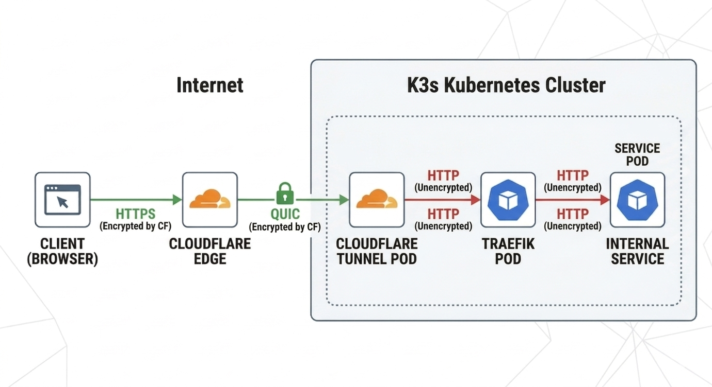
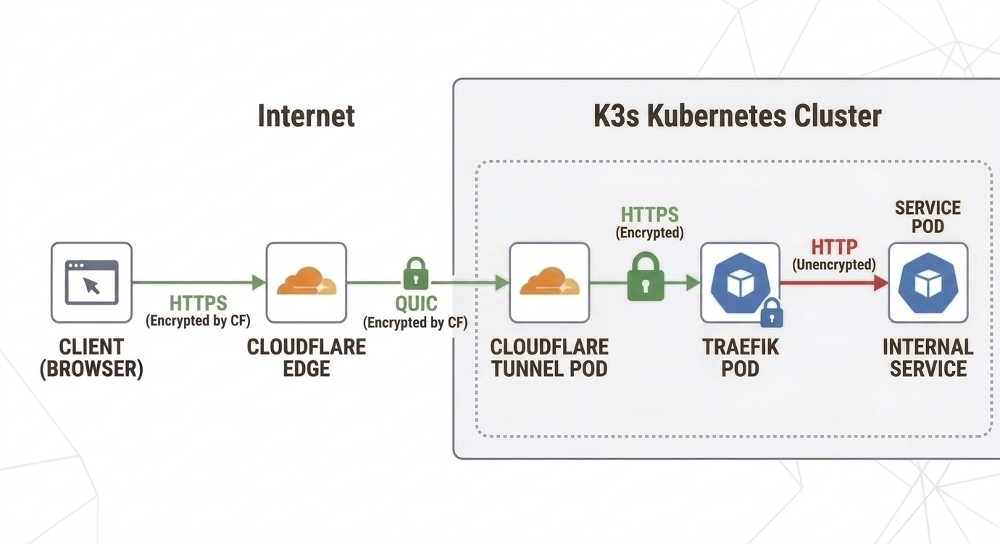

# K3s-Production-Cluster-with-Cloudflare-Tunnel
## Accessing Services from Private Kubernetes Cluster Using Cloudflared Tunnel
- Here we will run private Kubernetes cluster in local VM provisioned using Vagrantfile.
- We have no static Public IP for our Kubernetes Node.
- We are behind CGNAT.

### Prerequistics
- `virsh` cli
- [Vagrant]()
- [KVM](https://linux-kvm.org/page/Main_Page)
- Some Free Space on disk

### Virsh CLI
- Create Network with custom CIDR for our use-case.
- Network Configuration can be found in [k3s.xml](./k3s.xml)
  ```sh
  virsh net-define k3s.xml
  virsh net-autostart k3s
  virsh net-start k3s
  ```

- Confirmation:
  ```sh
  virsh net-list | grep -E "Name|k3s"
  ```
  Output:
  ```sh
  Name              State    Autostart   Persistent
  k3s               active   yes         yes
  ```

### Provisioned VM:
- Command:
  ```sh
  vagrant up
  ```
- Vagrant VM Status:
  ```sh
  vagrant status  
  ```
  Output:
  ```sh
  Current machine states:
  K3s-Master-01             running (libvirt)
  K3s-Worker-01             running (libvirt)
  K3s-Worker-02             running (libvirt)
  ```

- IP Address of VMs:
  ```sh
  printf "%-18s %-10s %-15s\n" "HOSTNAME" "INTERFACE" "IP ADDRESS"; for vm in $(vagrant status --machine-readable 2>/dev/null | awk -F, '$3=="state" && $4=="running"{print $2}'); do vagrant ssh $vm -c "ip -o -4 addr show" 2>/dev/null | awk -v node="$vm" '$2 != "lo" {split($4, a, "/"); printf "%-18s %-10s %-15s\n", node, $2, a[1]; node=""}'; done
  ```

  Output:
  ```sh
  HOSTNAME           INTERFACE  IP ADDRESS     
  K3s-Master-01      eth0       192.168.121.219
                     eth1       10.0.1.3       
  K3s-Worker-01      eth0       192.168.121.99 
                     eth1       10.0.1.4       
  K3s-Worker-02      eth0       192.168.121.106
                     eth1       10.0.1.5       
  ```
- Here: `eth0` is vagrant network interface whereas `eth1` is k3s interface.

## Create clusters:

- Master Node IP: `10.0.1.3`

### SSH into Master Node:
- Command:
  ```sh
  vagrant ssh K3s-Master-01
  ```

### For Embedded ETCD:

- SECRET=`bnb3Df1OCaGyQjIALnbZLq4QPVg6dsFF64tM5m9lW4iR`
- Command:
  ```sh
  sudo curl -sfL https://get.k3s.io | K3S_TOKEN=bnb3Df1OCaGyQjIALnbZLq4QPVg6dsFF64tM5m9lW4iR sh -s - server \
  --cluster-init \
  --node-ip=10.0.1.3 \
  --advertise-address=10.0.1.3 \
  --tls-san 10.0.1.3 \
  --flannel-backend=none \
  --disable-network-policy \
  --disable=servicelb \
  --disable=traefik \
  --write-kubeconfig-mode 644
  ```

- Export KubeConfig:
  ```sh
  KUBECONFIG=/etc/rancher/k3s/k3s.yaml
  ```
- We can also copy this config file in our home directory.
  ```sh
  mkdir -p $HOME/.kube
  sudo cp /etc/rancher/k3s/k3s.yaml $HOME/.kube/config
  sudo chown $USER:$USER $HOME/.kube/config
  ```

- Alias:
  ```sh
  cat <<'EOF' >> ~/.bashrc
  alias k=kubectl
  alias kaf='kubectl apply -f'
  alias kd='kubectl describe'
  alias kdf='kubectl delete -f'
  EOF
  source ~/.bashrc
  ```

- List Node:
  ```sh
  kubectl get nodes
  ```
  Output:
  ```sh
  NAME            STATUS       ROLES                AGE     VERSION
  k3s-master-01   NonReady    control-plane,etcd   3m59s   v1.34.5+k3s1
  ```

- List Pods:
  ```sh
  kubectl get po -A
  ```
  Output:
  ```
  NAMESPACE     NAME                                      READY   STATUS    RESTARTS   AGE
  kube-system   coredns-695cbbfcb9-l2mh9                  0/1     Pending   0          64s
  kube-system   local-path-provisioner-546dfc6456-jltnc   0/1     Pending   0          64s
  kube-system   metrics-server-c8774f4f4-7mj7b            0/1     Pending   0          64s
  ```

- As we can see node and all pods are in pending state because we have no CNI installed in our cluster.

### Install Calico as CNI:
- [Official Link](https://docs.tigera.io/calico/latest/getting-started/kubernetes/k3s/multi-node-install)
- Install CRD and Tigera Operator:
  ```sh
  kubectl create -f https://raw.githubusercontent.com/projectcalico/calico/v3.31.4/manifests/operator-crds.yaml
  kubectl create -f https://raw.githubusercontent.com/projectcalico/calico/v3.31.4/manifests/tigera-operator.yaml
  ```
- Install Calcio Resources:
  ```sh
  kubectl create -f https://raw.githubusercontent.com/projectcalico/calico/v3.31.4/manifests/custom-resources.yaml
  ```

- Verify node is `Ready` State:
  ```sh
  kubectl get nodes
  ```
  Output:
  ```
  NAME            STATUS   ROLES                AGE     VERSION
  k3s-master-01   Ready    control-plane,etcd   8m59s   v1.34.5+k3s1
  ```

- Verify all Pods is `Running` State:
  ```sh
  kubectl get po -A
  ```
  Output:
  ```sh
  NAMESPACE         NAME                                       READY   STATUS      RESTARTS   AGE
  calico-system     calico-apiserver-6995d97bc7-88b99          1/1     Running     0          4m16s
  calico-system     calico-apiserver-6995d97bc7-slvfm          1/1     Running     0          4m16s
  calico-system     calico-kube-controllers-64f7bc5b84-jvcz9   1/1     Running     0          4m15s
  calico-system     calico-node-mblp6                          1/1     Running     0          4m15s
  calico-system     calico-typha-5f4b8488bf-6vtlh              1/1     Running     0          4m15s
  calico-system     csi-node-driver-f4cfc                      2/2     Running     0          4m15s
  calico-system     goldmane-bdf669ffc-hxm6d                   1/1     Running     0          4m15s
  calico-system     whisker-5f9bccb85f-rgpmk                   2/2     Running     0          3m31s
  kube-system       coredns-695cbbfcb9-pxqzx                   1/1     Running     0          22m
  kube-system       helm-install-traefik-6bjjb                 0/1     Completed   2          22m
  kube-system       helm-install-traefik-crd-zjg6q             0/1     Completed   0          22m
  kube-system       local-path-provisioner-546dfc6456-d57m2    1/1     Running     0          22m
  kube-system       metrics-server-c8774f4f4-wcq97             1/1     Running     0          22m
  kube-system       svclb-traefik-ea10f17c-gqx42               2/2     Running     0          2m34s
  kube-system       traefik-788bc4688c-x59kk                   1/1     Running     0          2m34s
  tigera-operator   tigera-operator-5588576f44-62nj4           1/1     Running     0          4m38s
  ```

- Server Join Token:
  ```sh
  sudo cat /var/lib/rancher/k3s/server/node-token
  ```
  Output:
  ```sh
  K104f818f50a3ae6f38336e783b88a3cb4f65518ddcea93638788c377887386f86a::server:bnb3Df1OCaGyQjIALnbZLq4QPVg6dsFF64tM5m9lW4iR
  ```

## Kube-VIP
- [Official Link](https://kube-vip.io/docs/)
- Since we have created different network interface for entire k3s cluster i.e `k3s` with subnet `10.0.1.0/24`.
- We will use `kube-vip` for HA control plane and Load Balancer Service. 
- So far, we have used ips: `10.0.1.3`, `10.0.1.4` and `10.0.1.5`. 
- Now, we will use `10.0.1.34` to connect to our cluster when we will have more than one master node.
- IP Range between `10.0.1.50` to `10.0.1.253` is for Load Balancer Services.
- Follow, [Kube-VIP for K3s](https://kube-vip.io/docs/usage/k3s/) for more information.
- Our [Kube-VIP manifest](./Shared-Folder/Manifest-Files/Kube-VIP/) contains Service Account, Cluster Role, Cluster RoleBindings and DaemonSets for Kube-VIP pod.
- Deploy manifest:
  ```sh
  kubectl apply -f Shared-Folder/Manifest-Files/Kube-VIP
  ```

### Verify Master VIP:
- Before deploying our manifest file, our only master node has one IP for K3s cluster i.e `10.0.1.3`.
- Now after deploying our Kube-VIP manifest file, we can new IP attach to Master Node i.e `10.0.1.34`.
- Command to check on `K3s-Master-01` node:
  ```sh
  ip addr show eth1
  ```

  Output:
  ```sh
  ip addr show eth1
  3: eth1: <BROADCAST,MULTICAST,UP,LOWER_UP> mtu 1500 qdisc fq_codel state UP group default qlen 1000
      link/ether 52:54:00:75:2c:66 brd ff:ff:ff:ff:ff:ff
      altname enp0s6
      altname ens6
      inet 10.0.1.3/24 brd 10.0.1.255 scope global eth1
        valid_lft forever preferred_lft forever
      inet 10.0.1.34/32 scope global deprecated eth1
        valid_lft forever preferred_lft forever
      inet6 fe80::5054:ff:fe75:2c66/64 scope link 
        valid_lft forever preferred_lft forever
  ```

## Connection using new VIP `10.0.1.34`
- Initially, we use  `--tls-san 10.0.1.3`, we can not use same certificate for `10.0.1.34`.
- Command:
  ```sh
  sudo curl -sfL https://get.k3s.io | K3S_TOKEN=bnb3Df1OCaGyQjIALnbZLq4QPVg6dsFF64tM5m9lW4iR sh -s - server \
    --cluster-init \
    --node-ip=10.0.1.3 \
    --advertise-address=10.0.1.3 \
    --tls-san 10.0.1.3 \
    --tls-san 10.0.1.34 \
    --flannel-backend=none \
    --disable-network-policy \
    --disable=servicelb \
    --disable=traefik \
    --write-kubeconfig-mode 644
  sudo rm /var/lib/cattle/k3s/server/tls/dynamic-cert.json
  sudo systemctl restart k3s
  sudo cp /etc/rancher/k3s/k3s.yaml $HOME/.kube/config
  sudo chown $USER:$USER $HOME/.kube/config
  ```
- Now, download this `$HOME/.kube/config` in local machine and save as `k3s-cloudflare-tunnel.yaml` filename.
- Then, Run:
  ```sh
  sed -i 's|https://127.0.0.1:6443|https://10.0.1.34:6443|g' k3s-cloudflare-tunnel.yaml
  export KUBECONFIG=$(pwd)/k3s-cloudflare-tunnel.yaml
  ```

## Join Cluster:

### Worker Nodes:
#### K3s-Worker-01
- SSH into `K3s-Worker-01` node.
  ```sh
  vagrant ssh K3s-Worker-01
  ```

- IP Address: `10.0.1.4`
- K3S_TOKEN PATH: `/var/lib/rancher/k3s/server/node-token`
- Join Command:
  ```sh
  curl -sfL https://get.k3s.io | K3S_URL=https://10.0.1.34:6443 K3S_TOKEN=K104f818f50a3ae6f38336e783b88a3cb4f65518ddcea93638788c377887386f86a::server:bnb3Df1OCaGyQjIALnbZLq4QPVg6dsFF64tM5m9lW4iR sh -s - agent  \
  --node-ip=10.0.1.4
  ```

- List all nodes:
  ```sh
  kubectl get nodes
  ```
  Output:
  ```sh
  NAME            STATUS   ROLES                AGE     VERSION
  k3s-master-01   Ready    control-plane,etcd   8m59s   v1.34.5+k3s1
  k3s-worker-01   Ready    <none>               73s     v1.34.5+k3s1
  ```

#### K3s-Worker-02
- SSH into `K3s-Worker-02` node.
  ```sh
  vagrant ssh K3s-Worker-02
  ```

- IP Address: `10.0.1.5`
- K3S_TOKEN PATH: `/var/lib/rancher/k3s/server/node-token`
- Join Command:
  ```sh
  curl -sfL https://get.k3s.io | K3S_URL=https://10.0.1.34:6443 K3S_TOKEN=K104f818f50a3ae6f38336e783b88a3cb4f65518ddcea93638788c377887386f86a::server:bnb3Df1OCaGyQjIALnbZLq4QPVg6dsFF64tM5m9lW4iR sh -s - agent  \
  --node-ip=10.0.1.5
  ```

- List all nodes:
  ```sh
  kubectl get nodes
  ```
  Output:
  ```sh
  NAME            STATUS   ROLES                AGE     VERSION
  k3s-master-01   Ready    control-plane,etcd   13m     v1.34.5+k3s1
  k3s-worker-01   Ready    <none>               5m25s   v1.34.5+k3s1
  k3s-worker-02   Ready    <none>               2m9s    v1.34.5+k3s1
  ```


## Helm Installation
- Just like `kubectl`, `helm` is also used to deploy manifest files or releases of manifest files bundle as chart.
- Helm has it's own server to store many of the Manifest files in different versions.
- Command to install:
  ```sh
  curl -fsSL -o get_helm.sh https://raw.githubusercontent.com/helm/helm/main/scripts/get-helm-3
  chmod 700 get_helm.sh
  ./get_helm.sh
  ```
- Verify
  ```sh
  helm version
  ```
  Output
  ```sh
  version.BuildInfo{Version:"v3.20.0", GitCommit:"b2e4314fa0f229a1de7b4c981273f61d69ee5a59", GitTreeState:"clean", GoVersion:"go1.25.6"}
  ```

## Traefik Reverse Proxy
- Here, we will use Traefik as Reverse Proxy for our Services.
- We will use Traefik with Ingress as well as Gateway API.

- Gateway API CRD. We have to install CRD for Gateway API. Visit [Official Page](https://gateway-api.sigs.k8s.io/guides/getting-started/) for more information.
  ```sh
  kubectl apply --server-side -f https://github.com/kubernetes-sigs/gateway-api/releases/download/v1.5.0/standard-install.yaml
  ```

- Traefik CRD:
  ```sh
  kubectl apply -f https://raw.githubusercontent.com/traefik/traefik/v3.6/docs/content/reference/dynamic-configuration/kubernetes-crd-definition-v1.yml
  kubectl apply -f https://raw.githubusercontent.com/traefik/traefik/v3.6/docs/content/reference/dynamic-configuration/kubernetes-crd-rbac.yml
  ```

- Add traefik repo:
  ```sh
  helm repo add traefik https://traefik.github.io/charts
  helm repo update
  ```
- Verify:
  ```sh
  helm repo list
  ```
  Output:
  ```sh
  NAME    URL                             
  traefik https://traefik.github.io/charts
  ```

- Custom Values for Traefik Resources can be found here [traefik-values-noLTS.yaml](./Shared-Folder/Manifest-Files/Traefik/No-TLS/traefik-values-noTLS.yaml).

- Install Traefik from Helm Chart:
  ```sh
  helm install traefik traefik/traefik -n traefik --create-namespace -f Shared-Folder/Manifest-Files/Traefik/No-TLS/traefik-values-noTLS.yaml --skip-crds
  ```
- Verify:
  ```sh
  helm list -n traefik
  ```
  Output:
  ```sh
  NAME    NAMESPACE       REVISION        UPDATED                                 STATUS          CHART           APP VERSION
  traefik traefik         1               2026-03-18 14:31:44.366428394 +0000 UTC deployed        traefik-39.0.5  v3.6.10  
  ```
- List Traefik pod:
  ```sh
  kubectl get po -n traefik
  ```
  Output:
  ```sh
  NAME                       READY   STATUS    RESTARTS   AGE
  traefik-bf6644574-frc2c   1/1     Running   0          30s
  ```

- List Traefik Service:
  ```sh
  kubectl get svc -n traefik
  ```
  Output:
  ```sh
  NAME      TYPE           CLUSTER-IP    EXTERNAL-IP   PORT(S)                      AGE
  traefik   LoadBalancer   10.43.28.89   10.0.1.50     80:31417/TCP,443:31366/TCP   27s
  ```

### Traefik Gateway
- Deploy [Traefik Gateway](./Shared-Folder/Manifest-Files/Traefik/No-TLS/traefik-gateway-noTLS.yaml):
  ```sh
  kubectl apply -f Shared-Folder/Manifest-Files/Traefik/No-TLS/traefik-gateway-noTLS.yaml
  ```

### Deploy Nginx Services
- Deploy nginx:
  ```sh
  kubectl apply -f Shared-Folder/Manifest-Files/Test-Deploy/nginx-local.yaml 
  ```
  Output:
  ```sh
  deployment.apps/nginx-local-deploy created
  service/nginx-local-svc created
  ingress.networking.k8s.io/nginx-local-ingress created
  ingressroute.traefik.io/nginx-local-ingressroute created
  httproute.gateway.networking.k8s.io/nginx-local-httproute created
  ```

- Verify:
  ```sh
  kubectl get all,ingress,ingressRoute,httpRoute
  ```
  Output:
  ```sh
  NAME                                     READY   STATUS    RESTARTS   AGE
  pod/nginx-local-deploy-c57d7968d-z42bh   1/1     Running   0          21s

  NAME                      TYPE        CLUSTER-IP      EXTERNAL-IP   PORT(S)   AGE
  service/kubernetes        ClusterIP   10.43.0.1       <none>        443/TCP   117m
  service/nginx-local-svc   ClusterIP   10.43.162.130   <none>        80/TCP    21s

  NAME                                 READY   UP-TO-DATE   AVAILABLE   AGE
  deployment.apps/nginx-local-deploy   1/1     1            1           21s

  NAME                                           DESIRED   CURRENT   READY   AGE
  replicaset.apps/nginx-local-deploy-c57d7968d   1         1         1       21s

  NAME                                            CLASS     HOSTS                 ADDRESS     PORTS   AGE
  ingress.networking.k8s.io/nginx-local-ingress   traefik   ingress.nginx.local   10.0.1.50   80      21s

  NAME                                               AGE
  ingressroute.traefik.io/nginx-local-ingressroute   21s

  NAME                                                        HOSTNAMES                   AGE
  httproute.gateway.networking.k8s.io/nginx-local-httproute   ["httproute.nginx.local"]   21s
  ```

- Test services using `curl` command:
  ```sh
  curl -H "Host: ingress.nginx.local" http://10.0.1.50  
  curl -H "Host: ingressroute.nginx.local" http://10.0.1.50
  curl -H "Host: httproute.nginx.local" http://10.0.1.50
  ```

- Delete `Nginx-Local` Resource:
  ```sh
  kubectl delete -f Shared-Folder/Manifest-Files/Test-Deploy/nginx-local.yaml 
  ```

## Cloudflared Setup
- Since we do not have static Public IP and we are behind CGNAT. So we are using Cloudflared Tunnel to expose our Services.
### Prerequistics
- Create free account on [Cloudflare](https://www.cloudflare.com/).
- Add Domain inside Cloudflare Dashboard. For me, Domain is [sandab.me](https://sandab.me).

### Configure Cloudflare
- Install `Cloudflared` package:
  ```sh
  curl -fsSL https://pkg.cloudflare.com/cloudflare-main.gpg | sudo tee /usr/share/keyrings/cloudflare-main.gpg >/dev/null
  echo "deb [signed-by=/usr/share/keyrings/cloudflare-main.gpg] https://pkg.cloudflare.com/cloudflared $(lsb_release -cs) main" | sudo tee /etc/apt/sources.list.d/cloudflared.list
  sudo apt update && sudo apt install -y cloudflared
  ```

- Login to Cloudflare.
  ```sh
  cloudflared login
  ```

- Above command will open cloudflare dashboard in browser and select your choice of your domain. On success, this will save certificate PEM file in `$HOME/.cloudflared/cert.pem`.

- Create Cloudflare Tunnel. For me, the tunnel name is `k3s-cloudflared-tunnel`.
  ```sh
  cloudflared tunnel create k3s-cloudflared-tunnel
  ```

- Above command will save tunnel credentials in `$HOME/.cloudflared/<tunnel-id>.json`. For me, it is `$HOME/.cloudflared/b71433c0-c0f8-4ca9-ae68-b445ce521603.json`.

- Add DNS record for that tunnel.
  ```sh
  cloudflared tunnel route dns k3s-cloudflared-tunnel "*.sandab.me"
  cloudflared tunnel route dns k3s-cloudflared-tunnel "sandab.me"
  ```

- Create Kubernetes secret containing above tunnel's certificate.
  ```sh
  kubectl -n cloudflared create secret generic k3s-cloudflared-tunnel-credential --from-file=credentials.json=$HOME/.cloudflared/b71433c0-c0f8-4ca9-ae68-b445ce521603.json --dry-run=client -o yaml  > Shared-Folder/Manifest-Files/Cloudflared/cloudflared-secret.yaml
  ```
#### Cloudflare HTTP Connection
- Modify Hostname value in [cloudflared-cm-http.yaml](./Shared-Folder/Manifest-Files/Cloudflared/HTTP/cloudflared-cm-http.yaml).

- Cloudflare deployment manifest file can be found in [cloudflared-deploy.yaml](./Shared-Folder/Manifest-Files/Cloudflared/cloudflared-deploy.yaml)
- Apply Cloudflare Manifest files.
  ```sh
  kubectl apply -f Shared-Folder/Manifest-Files/Cloudflared/cloudflared-ns.yaml
  kubectl apply -f Shared-Folder/Manifest-Files/Cloudflared/cloudflared-secret.yaml
  kubectl apply -f Shared-Folder/Manifest-Files/Cloudflared/HTTP/cloudflared-cm-http.yaml
  kubectl apply -f Shared-Folder/Manifest-Files/Cloudflared/cloudflared-deploy.yaml
  ```
- Cloudflare resources will be deployed in `cloudflared` namespace.


## TCP Connection
- Deploy Postgres Database. Manifest file is in [postgres.yaml](./Shared-Folder/Manifest-Files/Test-Deploy/postgres.yaml)
- Command:
  ```sh
  kubectl apply -f Shared-Folder/Manifest-Files/Test-Deploy/postgres.yaml
  ```
- Verify:
  ```sh
  kubectl get po,svc
  ```
  Output:
  ```sh
  NAME                           READY   STATUS    RESTARTS   AGE
  pod/postgres-db986cfcd-nw2bm   1/1     Running   0          44s

  NAME                 TYPE        CLUSTER-IP      EXTERNAL-IP   PORT(S)    AGE
  service/kubernetes   ClusterIP   10.43.0.1       <none>        443/TCP    17m
  service/postgres     ClusterIP   10.43.122.208   <none>        5432/TCP   44s
  ```

- Install Postgresql Client:
  ```sh
  sudo apt update
  sudo apt install -y postgresql-client
  ```

- Test connection using ClusterIP: `10.43.122.208`:
  ```sh
  PGPASSWORD=password psql -U user -d db -h 10.43.122.208
  ```
  > Note: We must be inside `K3s-Master-01` node.

- On success, we will ve inside postgres shell.

### Exposing Postgres DB Connection using Cloudflared Tunnel.
- We will need to add below similar hostname inside cloudlare configMap with our database connection details:
  ```sh
  - hostname: "postgres-db.sandab.me"
    service: tcp://postgres.default.svc.cluster.local:5432
    originRequest:
      noTLSVerify: false
  ```
- Here, we do not need to add any DNS record because `postgres-db.sandab.me` already comes under `*.sandab.me`.

- Update Cloudflared Configmap:
  ```sh
  kubectl replace -f Shared-Folder/Manifest-Files/Cloudflared/HTTP/cloudflared-cm-http-tcp.yaml
  ```
  Output:
  ```sh
  configmap/cloudflared-shared replaced
  ```
- Rollout deployment with new configmap:
  ```sh
  kubectl -n cloudflared rollout restart deployment cloudflared-shared
  ```
  Output:
  ```sh
  deployment.apps/cloudflared-shared restarted
  ```

### Accessing Postgres DB exposed using cloudflared tunnel
- Cloudflare does NOT directly expose raw TCP publicly so we must connect through the Cloudflare Tunnel client (cloudflared) locally.
- Install `cloudflared` cli into client system. More details can be found in this [link](https://developers.cloudflare.com/cloudflare-one/networks/connectors/cloudflare-tunnel/downloads/):

- Exposing Postgres Service to local network, here `port` can be any from our choice:
  ```sh
  cloudflared access tcp --hostname postgres-db.sandab.me --url localhost:15432
  ```
  > Note: We have to keep open this tab for all the connection.

- Connecting to Postgres Service:
  ```sh
  PGPASSWORD=password psql -U user -d db -h localhost -p 15432
  ```

- If we intend to expose more TCP connection then we will have to follow same process:
  - First add hostname in `cloudflared` configmap. 
  - Modify DNS Record in Cloudflare (if needed).
  - Expose TCP locally using `cloudflared` cli.
  - Connect to TCP port using application.

> Note: There is CLI tool called [cloudflared-tcp](https://github.com/TheSpiritMan/Cloudflared-TCP) which I developed to manage multiple local connection.

- Delete Postgres:
  ```sh
  kubectl delete -f Shared-Folder/Manifest-Files/Test-Deploy/postgres.yaml
  ```

## HTTPS Connection
- Deploy WhoAmI with FQDN.
  
- Command:
  ```sh
  kubectl apply -f Shared-Folder/Manifest-Files/Test-Deploy/whoami-client-ip.yaml
  ```
  Output:
  ```
  deployment.apps/whoami created
  service/whoami-service created
  ingress.networking.k8s.io/whoami-ingress created
  ingressroute.traefik.io/whoami-ingressroute created
  httproute.gateway.networking.k8s.io/whoami-httproute created
  ```

- List `whoami` Resources:
  ```sh
  kubectl get all,ingress,ingressRoute,httpRoute
  ```
  Output
  ```sh
  NAME                          READY   STATUS    RESTARTS   AGE
  pod/whoami-7c7f4944c6-pd7vw   1/1     Running   0          4m7s

  NAME                     TYPE        CLUSTER-IP    EXTERNAL-IP   PORT(S)   AGE
  service/kubernetes       ClusterIP   10.43.0.1     <none>        443/TCP   32m
  service/whoami-service   ClusterIP   10.43.192.3   <none>        80/TCP    4m7s

  NAME                     READY   UP-TO-DATE   AVAILABLE   AGE
  deployment.apps/whoami   1/1     1            1           4m7s

  NAME                                DESIRED   CURRENT   READY   AGE
  replicaset.apps/whoami-7c7f4944c6   1         1         1       4m7s

  NAME                                       CLASS     HOSTS                ADDRESS     PORTS   AGE
  ingress.networking.k8s.io/whoami-ingress   traefik   clientip.sandab.me   10.0.1.50   80      4m7s

  NAME                                          AGE
  ingressroute.traefik.io/whoami-ingressroute   4m7s

  NAME                                                   HOSTNAMES                   AGE
  httproute.gateway.networking.k8s.io/whoami-httproute   ["clientip-hr.sandab.me"]   4m7s
  ```

- Test Domain using `curl`. We can even test in browser.
  ```sh
  curl https://clientip.sandab.me
  curl https://clientip-ir.sandab.me/ir
  ```
  Output:
  ```sh
  Hostname: whoami-7c7f4944c6-pd7vw
  IP: 127.0.0.1
  IP: ::1
  IP: 192.168.176.197
  IP: fe80::9cf9:e9ff:fe1d:4c7a
  RemoteAddr: 192.168.224.10:60672
  GET / HTTP/1.1
  Host: clientip.sandab.me
  User-Agent: curl/8.5.0
  Accept: */*
  Accept-Encoding: gzip, br
  Cdn-Loop: cloudflare; loops=1
  Cf-Connecting-Ip: 2405:acc0:1306:68f2:2948:433c:c4b9:8021
  Cf-Ipcountry: NP
  Cf-Ray: 9df6eb38ae3f7f59-KTM
  Cf-Visitor: {"scheme":"https"}
  Cf-Warp-Tag-Id: 936945f7-3057-4747-8c69-a531539d2da4
  X-Forwarded-For: 192.168.121.239
  X-Forwarded-Host: clientip.sandab.me
  X-Forwarded-Port: 80
  X-Forwarded-Proto: http
  X-Forwarded-Server: traefik-7c594588b4-x7596
  X-Real-Ip: 192.168.121.239
  ```
- But HTTPRoute gives `404` error:
  ```sh
  curl https://clientip-hr.sandab.me/hr
  ```
  Output:
  ```
  404 page not found
  ```

<!-- - Delete Nginx:
  ```sh
  kubectl delete -f Shared-Folder/Manifest-Files/Test-Deploy/nginx-global.yaml
  ``` -->

### Traffic Flow
- Till now, the traffic flows like this:

  

- Here:
  - Encrypted Segments (Green lines): HTTPS is used for communication between the browser and the Cloudflare Edge, and also between the Cloudflare Edge and the Cloudflare Daemon Pod within your K3s cluster. Cloudflare manages this encryption entirely.
  - Unencrypted Segments (Red dashed lines): Once traffic reaches the Cloudflare Daemon Pod, it continues as HTTP to the Traefik Pod and then finally to the Service itself, all within the K3s cluster.


## Encryption
- Since encrypted data are already inside `K3s Cluster`, most of the time we stopped at this point.
- But we can still add one more layer security at traefik level on Ingress, IngressRoute and HTTPRoute.
- We can generate Origin Certificate from Cloudflare Dashboard itself or we can use Certificate Manager according to our ease.
- For me, I have generated Origin Certificate from Cloudflare Dashboard and store at [Shared-Folder/Manifest-Files/Traefik/WithTLS/SSL-Cert](./Shared-Folder/Manifest-Files/Traefik/WithTLS/SSL-Cert/) under `fullchain.pem` and `privKey.pem` files.
<!-- - Switch `SSL/TLS` mode to `Full(Strict)` in Cloudflare. -->

- Generate TLS Secret from these files for Ingress Standard:
  ```sh
  kubectl create secret tls sandab-traefik-tls \
    --cert=Shared-Folder/Manifest-Files/Traefik/WithTLS/SSL-Cert/fullChain.pem \
    --key=Shared-Folder/Manifest-Files/Traefik/WithTLS/SSL-Cert/privKey.pem \
    -n traefik --dry-run=client -o yaml > Shared-Folder/Manifest-Files/Traefik/WithTLS/sandab-traefik-tls.yaml
  
  # Apply above TLS Secret:
  kubectl apply -f Shared-Folder/Manifest-Files/Traefik/WithTLS/sandab-traefik-tls.yaml
  ```
### Traefik with TLS
- Upgrade Helm Release with this TLS Certificates. New Traefik Resources can be found here [traefik-values-withTLS.yaml](./Shared-Folder/Manifest-Files/Traefik/WithTLS/traefik-values-withTLS.yaml).
  ```sh
  helm upgrade traefik traefik/traefik \
    -n traefik \
    -f Shared-Folder/Manifest-Files/Traefik/WithTLS/traefik-values-withTLS.yaml
  ```
  Output:
  ```sh
  Release "traefik" has been upgraded. Happy Helming!
  NAME: traefik
  LAST DEPLOYED: Fri Mar 13 19:29:07 2026
  NAMESPACE: traefik
  STATUS: deployed
  REVISION: 2
  TEST SUITE: None
  NOTES:
  traefik with docker.io/traefik:v3.6.10 has been deployed successfully on traefik namespace!
  ```

- List `tlsstore` from `traefik` namespace:
  ```sh
  kubectl get tlsstore -n traefik
  ```
  Output:
  ```sh
  NAME      AGE
  default   56s
  ```

- Describe `tlsstore` from `traefik` namespace:
  ```sh
  kubectl describe tlsstore default -n traefik
  ```
  Output:
  ```sh
  Name:         default
  Namespace:    traefik
  Labels:       app.kubernetes.io/instance=traefik-traefik
                app.kubernetes.io/managed-by=Helm
                app.kubernetes.io/name=traefik
                helm.sh/chart=traefik-39.0.5
  Annotations:  meta.helm.sh/release-name: traefik
                meta.helm.sh/release-namespace: traefik
  API Version:  traefik.io/v1alpha1
  Kind:         TLSStore
  Metadata:
    Creation Timestamp:  2026-03-13T19:29:08Z
    Generation:          1
    Resource Version:    111710
    UID:                 ceb9d68e-a32f-42e4-bc6f-7c9c5ee08ed5
  Spec:
    Default Certificate:
      Secret Name:  sandab-traefik-tls
  Events:           <none>
  ```

- Traefik Gateway with tls which can be found [traefik-gateway-withTLS.yaml](./Shared-Folder/Manifest-Files/Traefik/WithTLS/traefik-gateway-withTLS.yaml).
  ```sh
  kubectl replace -f Shared-Folder/Manifest-Files/Traefik/WithTLS/traefik-gateway-withTLS.yaml
  ```
- Deploy Middleware to force https.
  ```sh
  kubectl apply -f Shared-Folder/Manifest-Files/Traefik/WithTLS/traefik-middleware.yaml
  ```

- Delete Old Pod of `traefik` [Just In Case]:
  ```sh
  kubectl -n traefik delete pod $(kubectl get pods -n traefik -l app.kubernetes.io/name=traefik --no-headers -o custom-columns=NAME:.metadata.name)
  ```

- New pod will be start shortly.

#### Test if SSL is being served or not from `traefik` pod:
- Command:
  ```sh
  kubectl run tls-test --image=alpine --rm -it -- sh -c "apk update && apk add --no-cache openssl && openssl s_client -connect traefik.traefik.svc.cluster.local:443 -showcerts < /dev/null 2>/dev/null | openssl x509 -noout -text | grep DNS"
  ```
  Output:
  ```sh
  Certificate:  default
      Data::    traefik
          Version: 3 (0x2)etes.io/instance=traefik-traefik
          Serial Number:rnetes.io/managed-by=Helm
              7b:41:25:19:f2:09:98:04:fd:65:02:fb:91:6e:27:ba:78:61:78:5f
          Signature Algorithm: sha256WithRSAEncryption
          Issuer: C=US, O=CloudFlare, Inc., OU=CloudFlare Origin SSL Certificate Authority, L=San Francisco, ST=California
          Validityta.helm.sh/release-namespace: traefik
              Not Before: Mar 18 14:39:00 2026 GMT
              Not After : Mar 14 14:39:00 2041 GMT
          Subject: O=CloudFlare, Inc., OU=CloudFlare Origin CA, CN=CloudFlare Origin Certificate
          Subject Public Key Info:8T15:07:30Z
              Public Key Algorithm: rsaEncryption
                  Public-Key: (2048 bit)
                  Modulus:27b80bc-fca5-486e-af71-db51fe6ac1e4
                      00:db:b2:b9:76:56:9a:a0:1f:03:6b:93:9f:48:0f:
                      b1:6b:a1:f0:cb:cf:b4:f1:c9:f4:0d:63:3d:c9:42:
                      b9:e4:14:41:d7:34:36:a8:eb:1a:3a:2b:05:51:42:
                      ec:b4:98:d7:63:d1:6a:79:f1:26:42:6e:db:be:f9:
                      37:d0:94:a8:ca:2d:91:6c:7c:ab:82:71:e2:a1:21:get pods -n traefik -l app.kubernetes.io/name=traefik --no-headers -o custom-columns=NAME:.metadata.name)
                      b9:03:70:72:5a:86:85:02:64:df:20:02:f7:63:50:
                      0c:62:d2:06:b1:2d:92:da:29:4a:7e:0c:3d:08:c2: -it -- sh -c "apk update && apk add --no-cache openssl && openssl s_client -connect traefik.traefik.svc.cluster
                      9c:9b:18:20:b8:ef:4e:14:17:f1:37:0c:5c:06:5e:ut -text"
                      98:7c:b6:c4:9c:70:46:30:42:fc:e3:df:12:05:22:tainer logs, including credentials and sensitive information passed through the command prompt.
                      04:a7:85:a9:dc:70:f6:6a:92:67:1b:52:ab:33:d2:
                      63:d9:88:af:29:c8:28:b3:56:1d:cb:ae:ab:13:ad:
                      98:be:e8:e1:10:00:9d:c8:ca:50:03:b3:7c:26:24:
                      a4:b1:c5:d3:41:e1:4e:35:11:ae:94:eb:b9:18:05:
                      85:43:f5:a7:bc:d8:0e:b0:47:80:ff:f0:e3:31:ef:
                      da:ee:48:28:84:d5:79:85:4a:8c:23:26:53:92:8f:
                      86:97:33:5d:dc:1f:d1:0a:4f:be:e1:71:c9:60:10:
                      12:eb:fe:b1:3d:d5:c9:e7:74:51:25:97:4a:1d:35:
                      3a:69
                  Exponent: 65537 (0x10001)
          X509v3 extensions:
              X509v3 Key Usage: critical
                  Digital Signature, Key Encipherment
              X509v3 Extended Key Usage: 
                  TLS Web Client Authentication, TLS Web Server Authentication
              X509v3 Basic Constraints: critical
                  CA:FALSE
              X509v3 Subject Key Identifier: 
                  5D:6A:FE:1E:FF:4C:66:9B:87:6A:4C:E1:0F:D7:2C:37:04:E0:8D:D2
              X509v3 Authority Key Identifier: 
                  24:E8:53:57:5D:7C:34:40:87:A9:EB:94:DB:BA:E1:16:78:FC:29:A4
              Authority Information Access: 
                  OCSP - URI:http://ocsp.cloudflare.com/origin_ca
              X509v3 Subject Alternative Name: 
                  DNS:*.sandab.me, DNS:sandab.me
              X509v3 CRL Distribution Points: 
                  Full Name:
                    URI:http://crl.cloudflare.com/origin_ca.crl

      Signature Algorithm: sha256WithRSAEncryption
      Signature Value:
          16:14:c3:b1:35:4e:b4:7c:3b:38:ec:69:6c:d0:af:20:39:cc:
          88:ab:22:ed:ea:ca:f5:ed:4b:6a:6a:dc:23:29:dc:d0:ee:f9:
          9a:9f:2a:da:a2:48:9c:68:f9:ef:7d:2a:83:f0:a3:2c:e9:88:
          16:bc:46:62:a8:96:c8:e9:a0:16:30:53:de:71:5b:8c:07:ae:
          01:02:1c:62:95:83:7e:97:f5:8c:13:74:f8:2d:e9:34:49:65:
          8d:ef:f2:70:a3:f7:e0:ad:32:70:42:90:a6:2a:c9:93:10:6c:
          64:e0:95:6a:95:4b:b0:83:0f:16:61:6b:c4:47:94:bc:c4:84:
          48:d6:fa:6b:5a:f2:12:b7:9f:c8:2c:13:eb:18:4e:54:35:02:
          c4:a5:31:a3:b5:75:23:e5:fc:d2:76:f3:4e:07:4b:c7:e3:61:
          1e:e4:b8:68:00:99:ac:9a:ee:b6:ed:7f:1f:e3:32:95:1e:d8:
          18:95:ac:fc:27:ec:42:4b:7b:f6:10:c5:56:51:f3:7c:0a:b6:
          d7:58:3a:0e:73:c8:9e:81:7f:eb:c5:2c:d9:6a:1f:7d:4c:66:
          cd:8e:e4:34:14:61:5b:aa:ed:59:7a:d2:87:41:d0:24:b2:c3:
          71:dd:d4:4d:1a:da:17:2e:33:a7:83:99:e2:57:e2:13:13:55:
          01:f2:11:57
  ```

- In above output, it is confirmed that our SSL/TLS certificate is being used by traefik pod.

### Cloudflare HTTPS Connection 
- ConfigMap with HTTPS can be found here [cloudflared-cm-https.yaml](./Shared-Folder/Manifest-Files/Cloudflared/HTTPS/cloudflared-cm-https.yaml).
- Apply Cloudflare Manifest files.
  ```sh
  kubectl replace -f Shared-Folder/Manifest-Files/Cloudflared/HTTPS/cloudflared-cm-https.yaml
  ```
- Rollout new pod with latest configmap:
  ```sh
  kubectl rollout restart deployment cloudflared-shared -n cloudflared
  ```

- Test Domain using `curl`. We can even test in browser.
  ```sh
  curl http://clientip.sandab.me
  ```
- Here output of one `curl` command will look like below for me:
  ```sh
  Hostname: whoami-7c7f4944c6-rmnc2
  IP: 127.0.0.1
  IP: ::1
  IP: 192.168.176.247
  IP: fe80::f4aa:99ff:fe5a:c887
  RemoteAddr: 192.168.176.251:57838
  GET / HTTP/1.1
  Host: clientip.sandab.me
  User-Agent: curl/8.5.0
  Accept: */*
  Accept-Encoding: gzip
  Cdn-Loop: cloudflare; loops=1
  Cf-Connecting-Ip: 2405:acc0:1306:68f2:d87a:2996:25e7:4965
  Cf-Ipcountry: NP
  Cf-Ray: 9df6644f8a2986dd-KTM
  Cf-Visitor: {"scheme":"http"}
  Cf-Warp-Tag-Id: 2e16756f-b03c-4c85-b85b-fb9a30ae3f42
  X-Forwarded-For: 2405:acc0:1306:68f2:d87a:2996:25e7:4965, 10.0.1.4
  X-Forwarded-Host: clientip.sandab.me
  X-Forwarded-Port: 443
  X-Forwarded-Proto: https
  X-Forwarded-Server: traefik-667fbfbd48-g2w5j
  X-Real-Ip: 10.0.1.4
  ```

- In above output, we can see that `Cf-Visitor: {"scheme":"http"}`. This says Cloudflare is passing http request to http and is not redirecting to https. 
- Then `X-Forwarded-Proto: https`, this means traefik middleware is passing `https` Protocol to Application.

- To fix Cf-Visitory, Enable `Always Use HTTPS` feature in cloudflare domain section under `SSL/TLS` then `Edge Certificates`.
- Once that feature is enabled:
  ```sh
  curl -I  http://clientip.sandab.me 
  ```
  Output:
  ```sh
  HTTP/1.1 301 Moved Permanently
  Date: Fri, 20 Mar 2026 17:24:14 GMT
  Connection: keep-alive
  Location: https://clientip.sandab.me/
  Report-To: {"group":"cf-nel","max_age":604800,"endpoints":[{"url":"https://a.nel.cloudflare.com/report/v4?s=485YbCTDz54sJMi45j7bhJPfv0mzSekRxLZ0dsEjJDTJZbiyKBC%2FfJb9b0OMCJERJTy85kGI%2FVqO6hSggvY6smlgN0SeM0hVlQdbwqiIJ3eaIB07Y7ePo08z7gYpgg%3D%3D"}]}
  Nel: {"report_to":"cf-nel","success_fraction":0.0,"max_age":604800}
  Server: cloudflare
  CF-RAY: 9df668c64e4089ce-KTM
  alt-svc: h3=":443"; ma=86400
  ```
- Open Link [https://clientip.sandab.me/](https://clientip.sandab.me/) in browser:
  ```sh
  Hostname: whoami-7c7f4944c6-rmnc2
  IP: 127.0.0.1
  IP: ::1
  IP: 192.168.176.247
  IP: fe80::f4aa:99ff:fe5a:c887
  RemoteAddr: 192.168.176.251:48248
  GET / HTTP/1.1
  Host: clientip.sandab.me
  User-Agent: Mozilla/5.0 (X11; Linux x86_64) AppleWebKit/537.36 (KHTML, like Gecko) Chrome/146.0.0.0 Safari/537.36
  Accept: text/html,application/xhtml+xml,application/xml;q=0.9,image/avif,image/webp,image/apng,*/*;q=0.8
  Accept-Encoding: gzip, br
  Accept-Language: en-US,en;q=0.7
  Cdn-Loop: cloudflare; loops=1
  Cf-Connecting-Ip: 2405:acc0:1306:68f2:d87a:2996:25e7:4965
  Cf-Ipcountry: NP
  Cf-Ray: 9df66ae2a83bbd45-KTM
  Cf-Visitor: {"scheme":"https"}
  Cf-Warp-Tag-Id: 2e16756f-b03c-4c85-b85b-fb9a30ae3f42
  Priority: u=0, i
  Sec-Ch-Ua: "Chromium";v="146", "Not-A.Brand";v="24", "Brave";v="146"
  Sec-Ch-Ua-Mobile: ?0
  Sec-Ch-Ua-Platform: "Linux"
  Sec-Fetch-Dest: document
  Sec-Fetch-Mode: navigate
  Sec-Fetch-Site: none
  Sec-Fetch-User: ?1
  Sec-Gpc: 1
  Upgrade-Insecure-Requests: 1
  X-Forwarded-For: 2405:acc0:1306:68f2:d87a:2996:25e7:4965, 10.0.1.4
  X-Forwarded-Host: clientip.sandab.me
  X-Forwarded-Port: 443
  X-Forwarded-Proto: https
  X-Forwarded-Server: traefik-667fbfbd48-g2w5j
  X-Real-Ip: 10.0.1.4
  ```
### Traffic Flow
- After Full Encryption, traffic flows like this:

  


